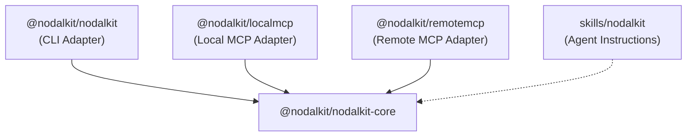
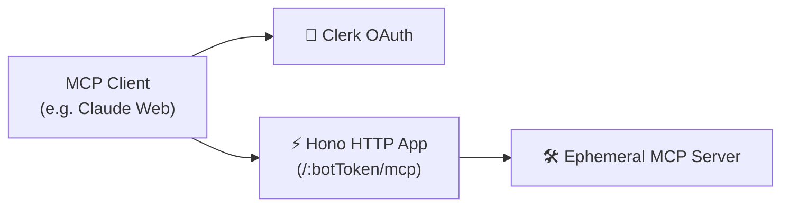

<div align="center">
  <h1>NodalKit</h1>
  <p><strong>Build agent-ready tools with one shared TypeScript core for MCP, CLI, and Skills.</strong></p>
  
  <p>
    <a href="./LICENSE"></a>
    <a href="https://github.com/nodalkit/nodalkit"></a>
  </p>
</div>

<br />

> **Prompt:** "Send my team a Telegram message saying the build shipped."
>
> **Agent:** Uses NodalKit's `telegram` MCP tool with `{ "chatId": "...", "message": "The build shipped." }`, backed by the same core operation available from the CLI and Skill.

## 📖 Table of Contents

- [Overview](#-overview)
- [System Architecture](#%EF%B8%8F-system-architecture)
- [Multi-Tenant Remote MCP](#-multi-tenant-remote-mcp)
- [Using NodalKit](#-using-nodalkit)
- [Engineering Learnings](#-engineering-learnings)

---

## 🌟 Overview

NodalKit is both a fully-functional tool and a reference architecture for modern agent tooling. It demonstrates how one shared operational core can power an entire agent-facing ecosystem: a command-line interface (CLI), a local MCP (stdio) tool, a remote MCP (HTTP) server, and AI agent instructions.

Currently, it features a canonical `sendTelegramMessage` operation, but the architectural boundaries make it simple to adapt to any internal workflow, SaaS integration, or automation.

---

## 🏗️ System Architecture

### The Adapter Pattern

The core philosophy of NodalKit is that **business logic belongs in one place**.



| Boundary                | Responsibility                                                                                                |
| :---------------------- | :------------------------------------------------------------------------------------------------------------ |
| **`packages/core`**     | Defines shared Zod schemas and executes the actual HTTP/API requests. No terminal output, no MCP SDK imports. |
| **`packages/cli`**      | Human/script adapter. Parses arguments, reads `~/.config/nodalkit`, and formats JSON or readable text.        |
| **`packages/localmcp`** | Agent adapter. Stdio server that registers MCP tools and extracts credentials from `process.env`.             |
| **`apps/remotemcp`**    | Deployed agent adapter. HTTP Hono server that handles OAuth via Clerk and extracts credentials per request.   |

### Credential Injection Strategy

NodalKit deliberately avoids putting credentials into MCP tool schemas. If an agent is forced to send a secret token in a tool call payload, the secret is leaked to the LLM context.

Instead, NodalKit handles credentials at the **Adapter** level:

- **CLI**: Reads from a local `config.json` generated by `nodalkit init`.
- **Local MCP**: Reads from `TELEGRAM_BOT_TOKEN` in the environment provided by the client (like Claude Desktop).
- **Remote MCP**: Extracts the token dynamically from the protected HTTP URL path.

---

## 🌐 Multi-Tenant Remote MCP

NodalKit includes a production-ready remote MCP HTTP server.



### Security Flow

1. **OAuth Verification**: The `/:botToken/mcp` endpoint validates the incoming Bearer token using `@clerk/backend`.
2. **Ephemeral Context**: A new, ephemeral MCP server is created for that exact request.
3. **Secret Binding**: The `botToken` is parsed from the URL and bound inside the `telegram` tool closure.
4. **Transport**: The request is proxied through `WebStandardStreamableHTTPServerTransport`.
5. **Teardown**: The ephemeral server shuts down immediately after the response.

---

## 🚀 Using NodalKit

### Local Usage (CLI)

```bash
# 1. Initialize configuration
bun run dev:cli init --telegram-bot-token "<bot-token>"

# 2. Send a message
bun run dev:cli telegram "<chat-id>" "Hello from NodalKit"

# 3. Scriptable Output
bun run dev:cli telegram "<chat-id>" "Hello from NodalKit" --json
```

### Agent Usage (Local MCP)

Configure your MCP client (e.g., Claude Desktop, OpenCode) to use the local stdio server:

```json
{
  "mcpServers": {
    "nodalkit": {
      "command": "bun",
      "args": ["run", "packages/localmcp/src/index.ts"],
      "environment": {
        "TELEGRAM_BOT_TOKEN": "<bot-token>"
      }
    }
  }
}
```

---

## 🔧 Engineering Learnings

<details>
<summary>🛡️ <strong>Keep Schemas Pure</strong></summary>
Input schemas (`telegramMessageInputSchema`) and internal operation schemas (`telegramMessageOptionsSchema`) are explicitly separated. If you mix them, you expose credentials to AI agents via the MCP tool definition.
</details>

<details>
<summary>⚡ <strong>Ephemeral Servers in Serverless Environments</strong></summary>
The Remote MCP app instantiates a new `McpServer` per request, binds the URL parameters (like `botToken`), processes the transport stream, and closes. This prevents cross-tenant data leaks and works beautifully in stateless serverless deployments.
</details>

<details>
<summary>🧩 <strong>Skill Documentation is Code</strong></summary>
Agents need documentation just like humans do. `SKILL.md` acts as an agent-facing "man page," instructing the LLM on when to use the MCP server vs. when to fall back to the CLI for manual debugging.
</details>
