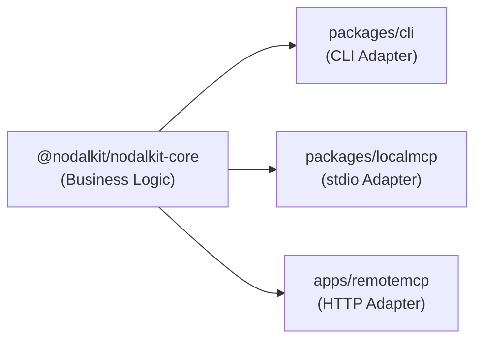

# NodalKit Engineering Knowledge Base & Instructions

NodalKit provides a unified operation structure (backed by `@nodalkit/nodalkit-core`) that exposes the exact same functionality via multiple agent-facing and human-facing interfaces:

1. **MCP tool** (`nodalkit` server → `telegram` tool) — Preferred for agents.
2. **CLI** (`@nodalkit/nodalkit`, binary `nodalkit`) — Fallback when MCP is unavailable or for script/human verification.
3. **Remote MCP** — For multi-tenant, HTTP-hosted tools over OAuth.

This document serves as both a set of agent instructions and an engineering knowledge base.

## 🏗️ Architectural Pattern

The central architectural pattern of NodalKit is the **Adapter Pattern**:



### 1. The Core Abstraction

- All business logic lives in `packages/core`.
- The core defines Zod schemas for shared inputs and outputs, operation functions, and type exports.
- **Rule**: Core functions _never_ include CLI imports, terminal output, prompts, `process.exit`, or MCP SDK imports.

### 2. The Adapters

- Adapters solely exist to parse inputs, inject credentials from the relevant environment, invoke core functions, and format the output.
- **CLI (`packages/cli`)**: Parses args via Commander, reads user configuration from the file system (`~/.config/nodalkit/config.json`), and prints readable or JSON output.
- **Local MCP (`packages/localmcp`)**: Exposes an MCP server over stdio. It relies on the client's environment variables (e.g., `TELEGRAM_BOT_TOKEN`) injected at runtime.
- **Remote MCP (`apps/remotemcp`)**: Exposes an MCP server via an HTTP/SSE bridge using Hono and Clerk OAuth. Uses the URL path parameters to extract secrets dynamically per-request.

---

## 🔑 Credential Workflow & Security

Credentials should **never** be part of an MCP tool's input schema unless the credential is the payload itself. Instead, NodalKit provisions credentials through context:

| Adapter        | Credential Source                           | Rationale                                                                                                                             |
| -------------- | ------------------------------------------- | ------------------------------------------------------------------------------------------------------------------------------------- |
| **CLI**        | `~/.config/nodalkit/config.json`            | Persistent configuration set via `nodalkit init`                                                                                      |
| **Local MCP**  | Server `environment` (`TELEGRAM_BOT_TOKEN`) | The MCP client handles injection safely, keeping it out of the prompt / tool call structure.                                          |
| **Remote MCP** | Per-request URL path parameter              | Allows a multi-tenant OAuth endpoint to serve different users securely. Clerk handles identity, while the URL specifies the instance. |

---

## 🤖 Agent Execution Rules

When a user asks to invoke a NodalKit capability (e.g., sending a Telegram message):

### Preferred: MCP Workflow

Always prefer calling the tool via the attached MCP server if available.

- For Telegram: `nodalkit` server -> `telegram` tool.
- Inputs required: `chatId` and `message`.
- **Important**: Do not pass the bot token into the tool call. The token is inherently supplied by the server adapter.

### Fallback: CLI Workflow

Use the CLI when the MCP server is not attached, or when manual testing is required.

1. Check for configuration or initialize:
   ```bash
   nodalkit init --telegram-bot-token <botToken>
   ```
2. Execute the operation:
   ```bash
   nodalkit telegram <chatId> <message>
   ```

### Verification

If you must parse CLI results, use JSON flags (if implemented by the CLI adapter) or parse the standardized output. The CLI explicitly abstracts `@nodalkit/nodalkit-core` execution and returns a predictable structure.
